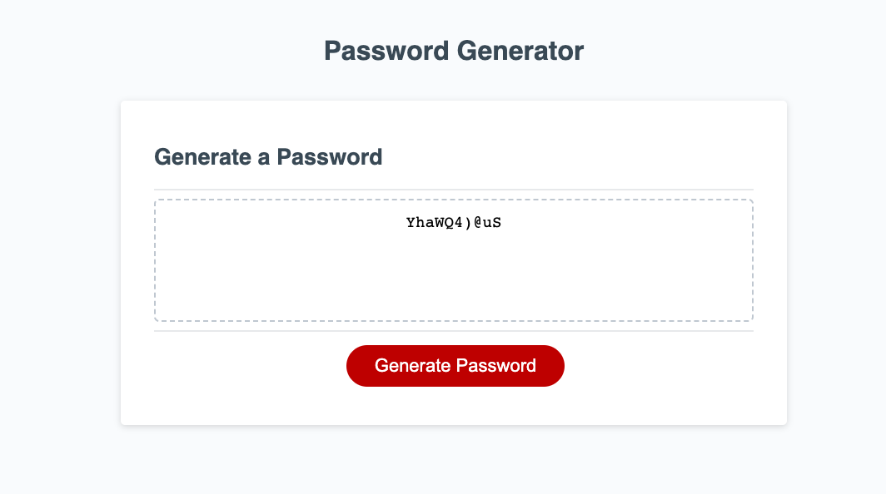

# Password Generator

Link: https://mahmoo30.github.io/password-generator/

## Randomly generates a password that meets certain criteria to create a strong password that provides greater security.

### When the user clicks the button to generate a password, they are presented with a series of prompts for password criteria which they can select to include in the password. This includes (1) the length of the password of at least 8 characters and no more than 128 characters, (2) lowercase, (3) uppercase, (4) numeric, and (5) special characters.

### When all prompts are answered, at least one character type need to be selected, otherwise the password generator will need to be restarted. When at least one character type is selected, a password is generated that matches the selected criteria that will be displayed to the page. 

